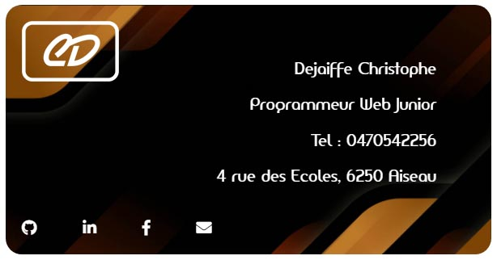

# Vcard

## Création d'une Vcard
---

### Les langages et outils utilisés 

* HTML5
* CSS3

<p>Présentation du code qui a été réalisé pour le projet. </p>

### Partie HTML
<details>
<summary>Fichier HTML</summary>
    
```markdown
<!DOCTYPE html>
<html lang="fr">
<head>
    <meta charset="UTF-8">
    <meta name="viewport" content="width=device-width, initial-scale=1.0">
    <meta http-equiv="X-UA-Compatible" content="ie=edge">
    <link rel="stylesheet" href="form.css" />
    <link rel="stylesheet" href="https://use.fontawesome.com/releases/v5.8.1/css/all.css" integrity="sha384-50oBUHEmvpQ+1lW4y57PTFmhCaXp0ML5d60M1M7uH2+nqUivzIebhndOJK28anvf" crossorigin="anonymous">
    <title>Vcard</title>
</head>
<body>
    <main>
        <div class="container">
            <div id="logo">
                
            </div>
            <div id="presentation">
                <p>Dejaiffe Christophe</p>
                <p>Programmeur Web Junior</p>
                <p>Tel : 0470542256</p>
                <p>4 rue des Ecoles, 6250 Aiseau</p>
            </div>
            <footer>
                <a href="https://github.com/christophedejaiffe" target="_blank" style="color: white;"><i class="fab fa-github"></i></a>
                <a href="https://www.linkedin.com/in/christophe-dejaiffe/" target="_blank" style="color: white;"><i class="fab fa-linkedin-in"></i></a>
                <a href="https://www.facebook.com/chrisophe.dejaiffe" target="_blank" style="color: white;"><i class="fab fa-facebook-f"></i></a>
                <a href="mailto:cdejaiffe@gmail.com" target="_blank" style="color: white;"><i class="fas fa-envelope"></i></a>
            </footer>
        </div>
    </main>
</body>
</html>
```
</details>

### Partie CSS
<details>
<summary>Fichier CSS</summary>
    
```markdown
/*police*/

@font-face 
{
  font-family: 'amerika_sansregular';
  src: url('fonts/amerikasans/VAMERSN__-webfont.eot');
  src: url('fonts/amerikasans/AMERSN__-webfont.eot?#iefix') format('embedded-opentype'),
       url('fonts/amerikasans/AMERSN__-webfont.woff2') format('woff2'),
       url('fonts/amerikasans/AMERSN__-webfont.woff') format('woff'),
       url('fonts/amerikasans/AMERSN__-webfont.ttf') format('truetype'),
       url('fonts/amerikasans/AMERSN__-webfont.svg#amerika_sansregular') format('svg');
  font-weight: normal;
  font-style: normal;

}

/*mise en page global*/

.container 
{
    display: grid;
    grid-template-columns: 1fr 2fr;
    grid-template-rows: auto 1fr auto;
    min-width: 200px;
}

main 
{
    margin: auto;
}

/*positions*/

#logo
{
    grid-column: 1; 
    grid-row: 2;
  }

#presentation 
{
    padding-top: 10%;
    grid-column: 2; 
    grid-row: 2;
}

footer 
{
    grid-column: 1 / span 2; 
    grid-row: 3;
}
  
  
/* Decoration */
  
* {box-sizing: border-box}
  
body 
{
      margin: 20px;
      background: #fff;
      font-family: "amerika_sansregular", helvetica, arial, sans-serif;
      font-size: 1.2em;
}

.container 
{
      background-image: url(image/fond.jpg);
      background-size: cover;   
      border-radius: 20px;
      margin-bottom: 2em;
      width: 600px;
      margin: auto;
}
div, nav, section, article, aside, header, footer 
{
      padding: 10px;
      color: #fff;
}
#logo 
{
        width: 200px;  
    
}
#presentation 
{
    padding-right: 10%;
    text-align: right;
    width: 360px;
}

footer 
{
    width: 560px;
    word-spacing: 50px;
  
}
```
</details>

## Résultat :




